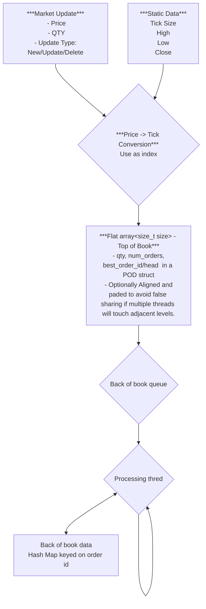

# JazzyOrderBook
***Requirement***<br/>
 - Can receive order by order updates.
 - generate Price ordered to of book (N levels) with volume aggregation.
 - (no requirement for volume aggregation outside of Tob of Book)
 
***Goal***<br/>
to replicate and if possibl improve on the order book ideas describe in cpp con video<br/>
do this by:<br/>
- *Replicatiopn*
    - ...
- *Possible Enhancement*
    - ...

***Rough layout***
```cpp
enum class UpdteType { INSERT, MODIFY, DELETE, UNKNOWN };
enum class Side { BUY, SELL, UNKNOWN };

using OrderID = char[12];
struct Price
{
 unsigned price
 short dp;
};

struct OrderUpdate
{
 UpdateType updateType;
 Price price;
 unsigned qty;
 Side side;
};
struct StaticData
{
  Price high, low, close;
  short tick_size;
};

struct Order
{
 OrderID id;
 unsigned ticks;
 unsigned qty;
 Side side;
};
struct OrderEntyLevel
{
  unsigned ticks;
  unsinged qty;
  Side side;
};
```
 


# Compre/Benchmark against some existing techniques
