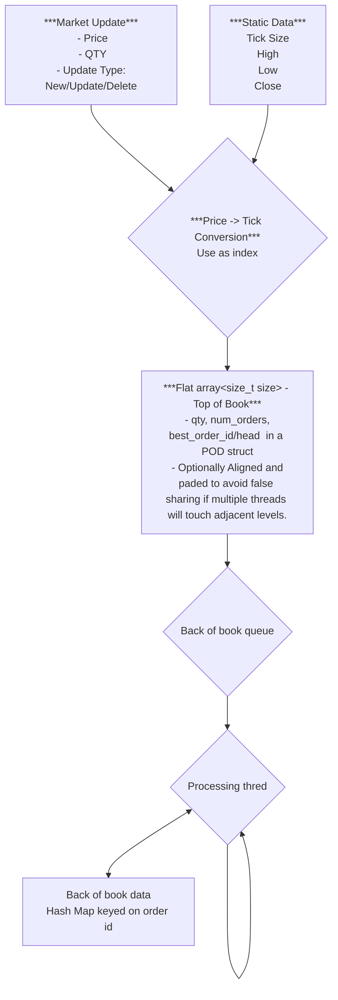

# JazzyOrderBook
***Requirement***<br/>
 - Can receive order by order updates.
 - generate Price ordered to of book (N levels) with volume aggregation.
 - (no requirement for volume aggregation outside of Tob of Book)
 
***Goal***<br/>
to replicate and if possibl improve on the order book ideas describe in cpp con video<br/>
do this by:<br/>
- *Replicatiopn*
    - ...
- *Possible Enhancement*
    - ...

***Rough layout***
```cpp
enum class UpdteType { INSERT, MODIFY, DELETE, UNKNOWN };
enum class Side { BUY, SELL, UNKNOWN };

template <typename T>
concept EqualityComparable = requires(const std::remove_reference_t<T>& a,
                                     const std::remove_reference_t<T>& b) {
    { a == b } -> std::convertible_to<bool>;
    { b == a } -> std::convertible_to<bool>; // symmetry
};

using Tick = unsigned;

struct Price
{
 unsigned price
 short dp;
};

struct OrderUpdate
{
 UpdateType updateType;
 Price price;
 unsigned qty;
 Side side;
};
struct StaticData
{
  Price high, low, close;
  short tick_size;
};

template<EqualityComparable OrderID>
struct Order
{
 OrderID id;
 unsigned ticks;
 unsigned qty;
 Side side;
};
struct OrderEntyLevel
{
  Tick ticks;
  unsinged qty;
  Side side;
};

template<size_t size, typename Storage = beman::inplace_vector<OrderEntyLevel, size>>
class TopOfBook
{
 public:
   TopOfBOok(const StaticData& sd)
    {
      //initialise storage range and base based off sttic data range
    }

    //accessors blah blah blah
 private:
  Storage _storage;
};

template<size_t initialSize, typename compare, typename Storage = std::map<Tick, OrderEntryLevel, compare>>
class BackOfBook
{
 //accessors blah blah blah
  private:
   Storage _storage;
};

template<EqualityComparable ID, typenme Storage = std::unordered_map<ID,Order>>
using  OrderStateStorage = Storage;

template<size_t size, typename SPSC_Lock_Free_Queue_t = some_jazz_from_some_lib<size, OrderUpdate>>
using SPSC_Lock_Free_Queue = SPSC_Lock_Free_Queue_t;

class JazzyOrderBook
{
  public:
    JazzyOrderBook(const StaticData& sd):_sd(sd)
   {
      _backThread(_runBckBook);
     _backThread.run();
   }
    template<typename T>
   void AddOrder(T && order)
   {
   Guard g(_lock);
   stateStorage.update_order(std::forward<T>(order));
   Tick tickPrice = convert_to_tock(order.price);
    if(check side && tickPrice >= end_orderbook_price) //price better than the end of the top of book size
     {
        update volume in top of book;
       
     }
     else
     {
       _q.push_bck(std::forward<T>(order));
     }
   }

    //other accessorys blaah blah ...
  private:
    void _runBackBook()
    {
      pin to core on same L2 cache
      while(true)
      {
        Order order;
        while(q.pop_front(order))
        {
           update volume in back of book.

          if(front book has moved too far up or down)
            break;
        }
        Guard g(_lock);
        generate new front of book.kinda like a rehash to centre the book.
        update meta data about end of end of top of book tick values.
      }
    }

   std::tread _backThread;
   spin_lock_type _lock;
   SPSC_Lock_Free_Queue _q;
   StaticData _sd;
   TopOfBook _top;
   BackOfBoo _back;
   OrderStateStorage _stateStorge;
};
```
 


# Compre/Benchmark against some existing techniques
