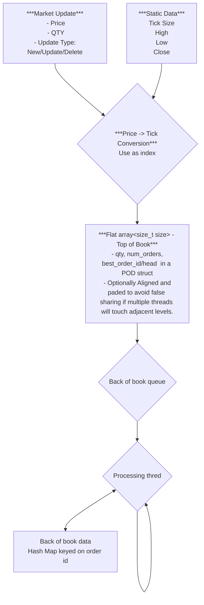

# JazzyOrderBook
***Requirement***<br/>
 - Can receive order by order updates.
 - generate Price ordered to of book (N levels) with volume aggregation.
 - (no requirement for volume aggregation outside of Tob of Book)
 
***Goal***<br/>
to replicate and if possibl improve on the order book ideas describe in cpp con video<br/>
do this by:<br/>
- *Replicatiopn*
    - ...
- *Possible Enhancement*
    - ...

***Phased Implementation**<br/>
- Phase 1 - replicate details from git hub talk. I.e. just the top of book. single threaded and discard all updates outside of window. No rebasing
- Phase 2 - add extensions. Offline of back of book stuff.
- Phase 3 - rebasing.

***Rough layout***
```cpp
enum class UpdteType { INSERT, MODIFY, DELETE, UNKNOWN };
enum class Side { BUY, SELL, UNKNOWN };

template <typename T>
concept EqualityComparable = requires(const std::remove_reference_t<T>& a,
                                     const std::remove_reference_t<T>& b) {
    { a == b } -> std::convertible_to<bool>;
    { b == a } -> std::convertible_to<bool>; // symmetry
};

using Tick = unsigned;

struct Price
{
 unsigned price
 short dp;
};

struct OrderUpdate
{
 UpdateType updateType;
 Price price;
 unsigned qty;
 Side side;
};
struct StaticData
{
  Price high, low, close;
  short tick_size;
};

template<EqualityComparable OrderID>
struct Order
{
 OrderID id;
 unsigned ticks;
 unsigned qty;
 Side side;
};
struct OrderEntyLevel
{
  Tick ticks;
  unsinged qty;
  Side side;
  //std::atomic<unsigned long> rebase_last_seen_sequence; may no need
};

template<int size, typename Storage = beman::inplace_vector<OrderEntyLevel, size>>
class TopOfBook
{
 public:
   TopOfBOok(const StaticData& sd, double expectedUpDownVariation) :base(sd.close)
    {
      //initialise storage range and base based off sttic data range
      //well rely on the concept of working set size here a bit so TopOfBook range will be a smaller subset of a quite large array so we don't have to reallocate
      auto total_size = size + ((high - low) * (1.0 * expectedUpDownVariation));
      _storage.resize(total_size);
      _lower = base - (size / 2);
      _upper = base + (size/2);
    }

    void update_order_at_level(const OrderUpdate& update, unsigned oldQty)
   {
      const auto priceTick = convetToPriceTick(update.price);
      const auto index = calc index off _base; //too tired to think about this. but assume base is the middle of the array and base contains the base tick value.
       auto& qty = _storage[priceTick]
       swtich(updte.updateTyp)
       {
         case NEW:
           qty+= update.qty;
              brek;
         case MODIFY:
            qty -= oldQty;
            qty+= update.qty;
            break;
         case DELETE:
            qty -= oldQty;
            brek;
         case UNKNOWN:
         default:
           do someting
       }

        //mark biitset at tick index;

           
    }

      //iterators using overlay. Do iterators for whole TOP of book as well as in bid order and ask order.
      //getters on BBO      

    //accessors and inserters blah blah blah
 private:
  Storte _storage;
  int _base;
  int _lower;
  int _upper;
  int _bb, bo; //best bid best offer tick values;
  std::bitset<size> overlay;
};

template<size_t initialSize, typename compare, typename Storage = std::map<Tick, OrderEntryLevel, compare>>
class BackOfBook
{
 //accessors and inserters blah blah blah
  private:
   Storage _storage;
};

template<EqualityComparable ID, typenme Storage = std::unordered_map<ID,Order>>
using  OrderStateStorage = Storage;


template<size_t size, typename SPSC_Lock_Free_Queue_t = some_jazz_from_some_lib<size, OrderUpdate>>
class SPSC_Lock_Free_Queue 
{
  //accessors 'n shiz
  void startRebasing(int baseOffset)
  {
     _rebase_size_count_down = _queue.size();
     _is_rebasing.store(baseOffset, MEMORY_ORDER_RELEASE); //pretty sure its release
   }

   auto pop_front()
   {
      auto rebasing = _rebaseOffset.load(MEMORY_ORDER_ACQUIRE); //pretty sure its acquire
      if(rebasing > 0)
      {
          auto elem = _queue.pop_front();
          if(--_rebase_size_count) 
            _rebaseOffset.store(0, MEMORY_ORDER_RELEASE); //pretty sure its release
       }
   }

   bool isRebasing() const noexcept
  {
    return _rebaseOffset.load(MEMORY_ORDER_ACQUIRE) == 0; //pretty sure its acquire
   }
  private:
  SPSC_Lock_Free_Queue_t _queue;
  std::atomic<int> _rebaseOffset{0};
  size_t _rebase_size_count_down;
};

auto convert_to_tick(......)
{}

class JazzyOrderBook
{
  public:
    JazzyOrderBook(const StaticData& sd):_sd(sd)
   {
      _backThread(_runBckBook);
     _backThread.run();
   }
    template<typename T>
   void AddOrder(T && orderUpadte)
   {
   Order order = stateStorage.update_order(std::forward<T>(order)); //updates order status based on ID
   Tick tickPrice = convert_to_tick(order.price);
    if(check side && tickPrice >= end_orderbook_price || (_queue.isRebasing() && tickPrice inside high/low and rebase offset)) //price better than the end of the top of book size
     {
       _top.update_order_at_level(update);
     }
     else
     {
       _q.push_bck(std::forward<T>(levelUpdate));
     }
   }

    //other accessorys blaah blah ...
  private:
    void _runBackBook()
    {
      //pin to core on same L2 cache as main thread
      while(true)
      {
        OrderUpdate update;
        while(q.pop_front(update))
        {
           _back.update_order_at_level(update);
           if(_q.isRebasing())
              _top.update_order_at_level(update);
        }
         
      }
    }

   std::tread _backThread;
  BaseDetais _baseDetails;
   SPSC_Lock_Free_Queue _q;
   StaticData _sd;
   TopOfBook _top;
   BackOfBoo _back;
   OrderStateStorage _stateStorge;
};
```
 


# Compre/Benchmark against some existing techniques
