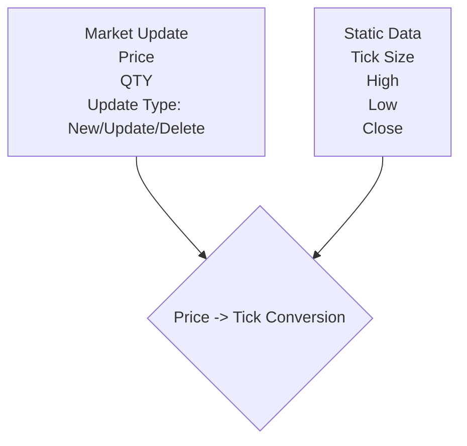

# JazzyOrderBook

```mermaid
flowchart TD
  A[Market Update<br/>Price<br/>QTY<br/>Update Type: New/Update/Delete] --> C{Price -> Tick Conversion}
  B[Static Data<br/>Tick Size<br/>High<br/>Low<br/>Close<br/>] --> C
```
