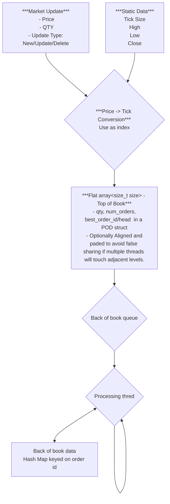

# JazzyOrderBook
***Requirement***
    Can receive order by order updates. 
    generate Price ordered to of book (N levels) with volume aggregation. 
    (no requirement for volume aggregation outside of Tob of Book)
***Goal***
    to replicate and improve on the order book ideas describe in cpp con video
    do this by:
        - *replicate*
        - 

# Compre/Benchmark against some existing techniques
