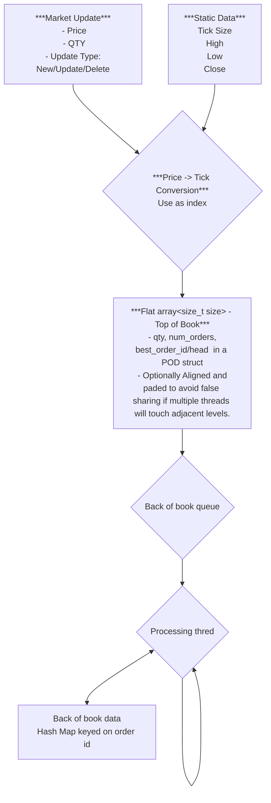

# JazzyOrderBook
***Requirement***<br/>
 - Can receive order by order updates.
 - generate Price ordered to of book (N levels) with volume aggregation.
 - (no requirement for volume aggregation outside of Tob of Book)
 
***Goal***<br/>
to replicate and if possibl improve on the order book ideas describe in cpp con video<br/>
do this by:<br/>
- *Replicatiopn*
    - ...
- *Possible Enhancement*
    - ...

***Rough layout***
```cpp
enum class UpdteType { INSERT, MODIFY, DELETE, UNKNOWN };
enum class Side { BUY, SELL, UNKNOWN };

template <typename T>
concept EqualityComparable = requires(const std::remove_reference_t<T>& a,
                                     const std::remove_reference_t<T>& b) {
    { a == b } -> std::convertible_to<bool>;
    { b == a } -> std::convertible_to<bool>; // symmetry
};

using Tick = unsigned;

struct Price
{
 unsigned price
 short dp;
};

struct OrderUpdate
{
 UpdateType updateType;
 Price price;
 unsigned qty;
 Side side;
};
struct StaticData
{
  Price high, low, close;
  short tick_size;
};

template<EqualityComparable OrderID>
struct Order
{
 OrderID id;
 unsigned ticks;
 unsigned qty;
 Side side;
};
struct OrderEntyLevel
{
  Tick ticks;
  unsinged qty;
  Side side;
};

template<size_t size, typename Storage = beman::inplace_vector<OrderEntyLevel, size>>
class TopOfBook
{
 public:
   TopOfBOok(const StaticData& sd)
    {
      //initialise storage range and base based off sttic data range
    }

    //accessors blah blah blah
 private:
  Storage _storage;
};

template<size_t initialSize, typename compare, typename Storage = std::map<Tick, OrderEntryLevel, compare>>
class BackOfBook
{
 //accessors blah blah blah
  private:
   Storage _storage;
};

template<EqualityComparable ID, typenme OrderStateStorage = std::unordered_map<ID,Order>>
using  OrderStateStorage_t = OrderStateStorage;
```
 


# Compre/Benchmark against some existing techniques
