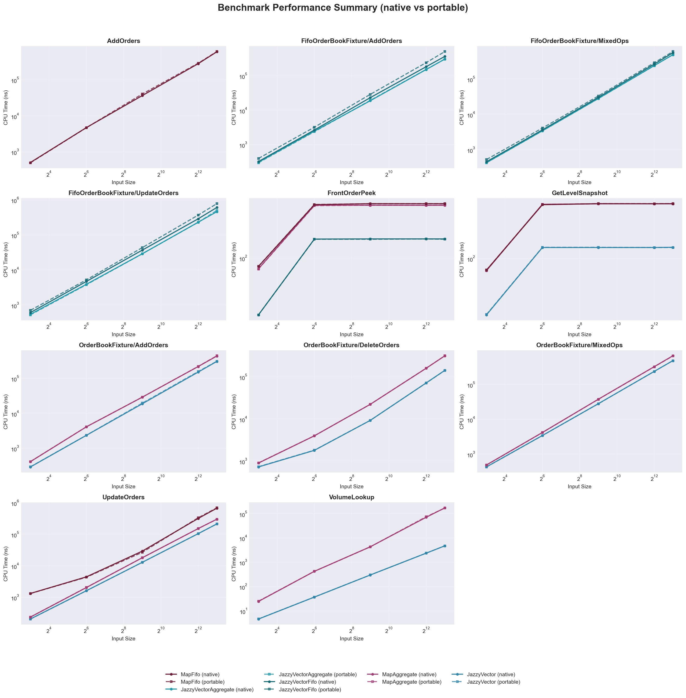

# JazzyOrderBook

JazzyOrderBook is a modern C++23 library for building fast limit-order book
aggregations. It keeps price levels in a densely packed vector sized from
compile-time market statistics, which allows constant-time volume updates and
cheap scans to the best bid/ask.

## Highlights
- Header-only core shipped as the `jazzy::jazzy` CMake target (C++23 /
  CMake 3.21+).
- Compile-time `market_statistics` carve out the tick range, eliminating dynamic
  allocations and enabling predictable cache-friendly access.
- Dense vector storage plus population bitsets provide constant-time updates and
  best-price scans; FIFO adapters cover front-of-queue inspection workloads.
- Concept-based traits (`jazzy_order_*`) adapt any order structure with
  compile-time diagnostics for misuse.
- Benchmarks pit JazzyVector against the map-based aggregate/fifo references,
  including a portable build variant and scripts to capture hardware-specific
  "best runs".
- Python reporting pipeline converts JSON or stored console output into visual
  comparisons of native versus portable performance.

## Usage

```cpp
#include <cstdint>
#include <jazzy/order_book.hpp>
#include <jazzy/types.hpp>

struct order
{
    std::int64_t order_id{};
    std::int64_t volume{};
    int tick{};
};

inline std::int64_t jazzy_order_id_getter(order const& o) { return o.order_id; }
inline std::int64_t jazzy_order_volume_getter(order const& o) { return o.volume; }
inline int jazzy_order_tick_getter(order const& o) { return o.tick; }
inline void jazzy_order_volume_setter(order& o, std::int64_t v) { o.volume = v; }
inline void jazzy_order_tick_setter(order& o, int v) { o.tick = v; }

using stats = jazzy::market_statistics<int, 130, 90, 110, 2000>;
using book_t = jazzy::order_book<int, order, stats>;

book_t book{};
book.insert_bid(101, order{.order_id = 1, .volume = 10});
book.insert_ask(105, order{.order_id = 2, .volume = 12});

auto best_bid = book.bid_at_level(0);
auto best_ask = book.ask_at_level(0);
```

## Building

1. Configure the project:

   ```bash
   cmake -S . -B build
   ```

2. Build the headers, tests, and benchmarks:

   ```bash
   cmake --build build
   ```

You can embed JazzyOrderBook into another CMake project by adding this
repository as a subdirectory and linking against `jazzy::jazzy`.

## Tests

The test suite is driven by Catch2 (the single-header dependency is vendored in
`tests/`). To build and run the tests:

```bash
cmake --build build --target tests
./build/tests/tests
```

Alternatively, execute all tests with CTest:

```bash
ctest --test-dir build
```

The regression scenarios exercise order insertion, modification, removal,
best-price scanning, range validation, and the `tick_type_strong` utility.

## Benchmarks

Benchmarks compare `jazzy::order_book` with the tree-based reference
implementation located in `benchmarks/map_order_book.hpp`:

```bash
cmake --build build --target benchmarks
./build/benchmarks/benchmarks
```

To force the portable `level_bitmap` implementation (all compiler builtins
disabled) build and run the dedicated target:

```bash
cmake --build build --target benchmarks_portable
./build/benchmarks/benchmarks_portable
```

Sample outputs are stored under `benchmark_results/`. The helper script
`scripts/benchmark_compare.sh` runs the benchmark, captures the result keyed by
your CPU (using `scripts/detect_hardware.sh`), and lets you diff against the
current best run:

```bash
# Native benchmark vs saved best; promote on demand
./scripts/benchmark_compare.sh

# Portable baseline (compiler builtins disabled)
./scripts/benchmark_compare.sh --portable

# View the saved best native vs portable runs side-by-side
./scripts/benchmark_compare.sh --compare-best
```

Each run is archived beneath `benchmark_results/<hardware>_best.txt` (and
`*_portable_best.txt`), making it easy to track regressions over time.

### Realistic Workload Distribution

The update benchmarks use a realistic access pattern that mirrors production order book behavior:
- **75% of all update operations** target orders in the **top 5 price levels** (best bid/ask and nearby ticks)
- **25% of updates** are spread across the remaining price levels

This concentration reflects real market microstructure where liquidity clusters at the inside spread.
Even under this challenging workload, `jazzy::order_book` maintains significant performance advantages
over map-based implementations at production scale (N≥512 orders).

### Benchmark Visualization

The project includes a Python visualization tool to generate performance comparison charts:

```bash
# Install dependencies
pip install -r scripts/requirements.txt

# (Optional) one-shot setup
bash scripts/setup.sh

# Run benchmarks and generate charts
python3 scripts/visualize_benchmarks.py

# Use existing benchmark results
python3 scripts/visualize_benchmarks.py --json-input benchmark_results/your_results.json

# Visualize stored native vs portable best runs
python3 scripts/visualize_benchmarks.py --use-best
```

The script generates several visualization types in the [benchmark_results/](benchmark_results/) directory:

#### Performance Summary


#### Bar Chart Comparison


See [scripts/README.md](scripts/README.md) for detailed usage instructions and individual operation plots.

## Project Layout

- `include/jazzy/` – public headers (`order_book.hpp`, `traits.hpp`,
  `types.hpp`).
- `tests/` – Catch2 regression and property tests together with the sample
  `tests/order.hpp` adapter.
- `benchmarks/` – Google Benchmark harness and the map-based baseline book.
- `include/jazzy/detail/select_nth.hpp` – branch-friendly selection helper used inside the
  order book.
- `include/jazzy/detail/level_bitmap.hpp` – compact bitmap wrapper enabling fast level scans.
- `scripts/` – helper scripts for benchmarks, visualization, and environment setup.
- `benchmark_results/` – archived benchmark runs and plots (keyed by detected hardware).

## License

Licensed under the Apache License, Version 2.0. See `LICENSE` for details.

## CI

[](https://github.com/mattyv/JazzyOrderBook/actions)
